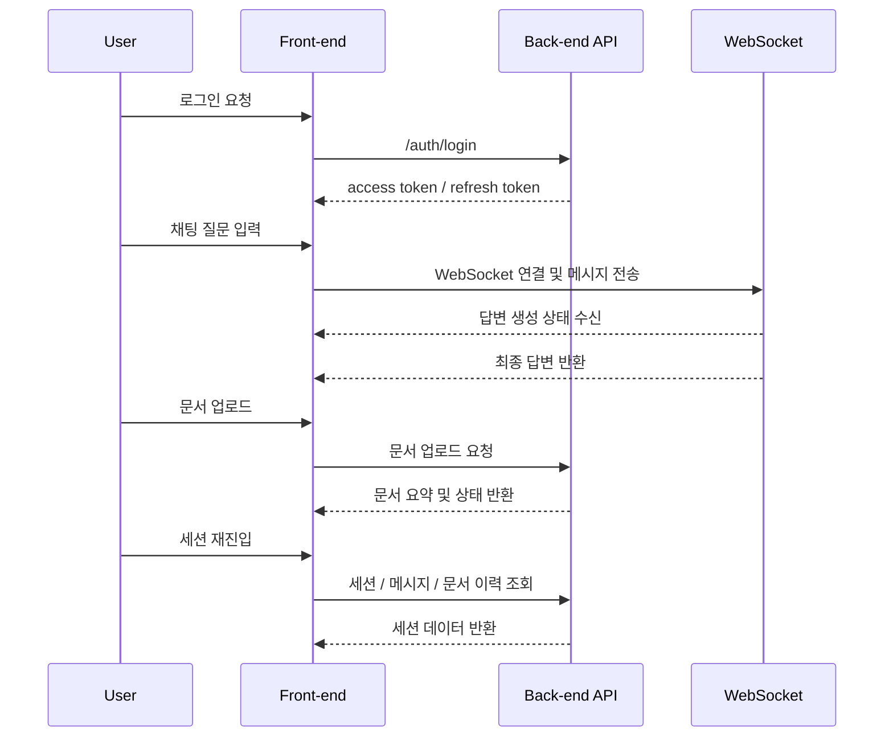

# ⚖️ Legal Chat Bot Front-end

법률 상담 챗봇 서비스의 **React + Vite 기반 프론트엔드 애플리케이션**입니다.

사용자는 웹 화면에서 회원가입 및 로그인 후 채팅 세션을 생성하고,  
법률 질문을 입력하거나 문서를 업로드하여 **RAG 기반 법률 상담**을 받을 수 있습니다.

또한 관리자 계정으로 접속하면 사용자, 문서, 채팅, 시스템 로그를 관리할 수 있습니다.

---

## 프로젝트 개요

Legal Chat Bot Front-end는 사용자가 법률 AI 서비스와 상호작용하는 메인 인터페이스입니다.

이 프로젝트는 다음과 같은 흐름을 중심으로 구성됩니다.

- 이메일 로그인 및 회원가입, 카카오 소셜 로그인
- 채팅 세션 생성 및 세션별 대화 이력 관리
- WebSocket 기반 실시간 질의응답
- 문서 업로드 및 문서 요약 확인
- 관리자 전용 대시보드 및 데이터 관리 화면

프론트엔드는 백엔드 API와 WebSocket 서버에 연결되어,  
사용자 질문과 업로드 문서를 기반으로 생성된 법률 답변을 시각적으로 제공합니다.

---
### 인증 및 사용자 관리

- 이메일 기반 회원가입 / 로그인
- JWT Access Token / Refresh Token 저장 및 재발급 처리
- 카카오 OAuth 로그인 연동
- 사용자 정보 조회 및 수정
- 회원 탈퇴 / 로그아웃 처리
- 관리자 / 일반 사용자 권한 분기

### 실시간 채팅

- WebSocket 기반 실시간 채팅 연결
- 새 채팅 세션 생성 및 기존 세션 재진입
- 세션별 메시지 이력 조회
- 답변 생성 중 로딩 상태 표시
- Assistant 응답 타이핑 애니메이션
- 최근 채팅 / 검색 오버레이 기반 세션 탐색

### 문서 업로드 및 문서 기반 상담

- 채팅 세션 단위 문서 업로드
- 드래그 앤 드롭 문서 첨부
- 업로드 문서 요약 결과 표시
- 문서 목록 조회 및 삭제
- 질문 입력과 문서 첨부의 동시 전송 방지 UX 제공

### 관리자 화면

- 관리자 전용 대시보드 진입
- 사용자 목록 조회
- 전체 문서 목록 조회 / 삭제
- 전체 채팅 및 메시지 이력 조회
- 시스템 로그 조회

---

## 화면 구성

### 로그인 / 회원가입

| 로그인 | 회원가입 |
| --- | --- |
|  |  |

<br />

### 채팅 화면

| 새 대화 화면 | 채팅 진행 화면 |
| --- | --- |
|  |  |

<br />

### 마이페이지

| 계정 설정 화면 |
| --- |
|  |

<br />

### 관리자 대시보드

| 관리자 대시보드 |
| --- |
|  |

<br />

## Tech Stack

| Category       | Stack                                                                                                                                                                                                 |
| -------------- | ----------------------------------------------------------------------------------------------------------------------------------------------------------------------------------------------------- |
| Language       |                                                                                |
| Frontend       |   |
| Styling        |   |
| State Manager  |                                                                                                         |
| Routing        |                                                                           |
| Communication  |                           |
| Infra / Tools  |   |

---
## 사용자 흐름



---

## 페이지 구조
### 사용자 페이지
- `/signin` : 로그인
- `/signup` : 회원가입
- `/auth/kakao/callback` : 카카오 로그인 콜백
- `/chat` : 채팅 메인
- `/chat/:sessionId` : 특정 채팅 세션 진입

### 사용자 패널
- Chat 패널 : 질문 입력 및 답변 확인
- Documents 패널 : 업로드 문서 목록 확인
- MyPage 패널 : 사용자 정보 확인 및 수정

### 관리자 페이지
- `/admin` : 관리자 대시보드
- `/admin/users` : 사용자 관리
- `/admin/documents` : 문서 관리
- `/admin/chats` : 채팅 모니터링
- `/admin/systems` : 시스템 로그 / 상태 조회

---

## 환경 변수
프로젝트 루트에 .env 파일을 생성합니다.
```env
VITE_API_BASE_URL=http://localhost:8000
```
| Variable | Description | Example |
| --- | --- | --- |
| `VITE_API_BASE_URL` | 백엔드 API 및 WebSocket 연결 기준 URL | `http://localhost:8000` |

## 프로젝트 구조

```txt
Front-end/
├─ public/
│  └─ favicon.svg
├─ src/
│  ├─ components/
│  │  ├─ notifications/
│  │  └─ ui/
│  ├─ data/
│  ├─ layouts/
│  │  ├─ AdminLayout.tsx
│  │  └─ ChatLayout.tsx
│  ├─ lib/
│  │  ├─ apiClient.ts
│  │  ├─ authApi.ts
│  │  ├─ chatApi.ts
│  │  ├─ chatSocket.ts
│  │  ├─ tokenStorage.ts
│  │  └─ userApi.ts
│  ├─ pages/
│  │  ├─ ChatPage.tsx
│  │  ├─ DocumentsPage.tsx
│  │  ├─ MyPage.tsx
│  │  ├─ SignInPage.tsx
│  │  ├─ SignUpPage.tsx
│  │  ├─ KakaoCallbackPage.tsx
│  │  └─ admin/
│  ├─ stores/
│  │  ├─ authStore.ts
│  │  ├─ chatStore.ts
│  │  ├─ documentStore.ts
│  │  ├─ notificationStore.ts
│  │  └─ uiStore.ts
│  ├─ styles/
│  ├─ types/
│  ├─ App.tsx
│  ├─ main.tsx
│  └─ index.css
├─ index.html
├─ package.json
├─ vite.config.ts
├─ tailwind.config.ts
├─ Dockerfile
└─ README.md
```
---
## 실행 방법
### 1. Repository Clone
```bash
git clone https://github.com/Legal-Chat-Bot/Front-end.git
cd Front-end
```
### 2. 패키지 설치
```bash
npm install
```
### 3. 환경 변수 설정
```bash
VITE_API_BASE_URL=http://localhost:8000
```
### 4. 개발 서버 실행
```bash
npm run dev
```
정상 실행되면 다음 주소에서 확인할 수 있습니다.
```txt
http://localhost:5173
```
## 빌드 방법
```bash
npm run build
```
빌드 결과물은 dist/ 디렉터리에 생성됩니다.
## Docker 실행
```bash
docker build -t legal-chat-frontend .
```
```bash
docker run -p 5173:5173 legal-chat-frontend
```
## 백엔드 연동 포인트
프론트엔드는 다음 백엔드 기능과 연결됩니다.
- `/auth/*` : 로그인, 회원가입, 토큰 재발급, 카카오 로그인
- `/chat/*` : 세션 생성, 세션 목록 조회, 문서 업로드, 문서 조회
- `/user/*` : 사용자 정보 조회 / 수정
- `/admin/*` : 관리자 전용 데이터 조회
- `/ws/chat` : 실시간 채팅 WebSocket 연결
---
## 구현 포인트

### 인증 처리

- JWT Access Token / Refresh Token 기반 인증 흐름 구현
- Access Token 만료 시 Refresh Token을 통한 자동 재발급 처리
- 카카오 OAuth 로그인 연동 및 소셜 로그인 후 사용자 상태 동기화

### 실시간 채팅

- WebSocket 기반 실시간 질의응답 인터페이스 구현
- 새 채팅 세션 생성 및 기존 세션 재진입 흐름 처리
- 답변 생성 중 로딩 상태 및 타이핑 애니메이션 제공

### 문서 업로드 및 문서 기반 상담

- 채팅 세션 단위 문서 업로드 기능 구현
- 드래그 앤 드롭 기반 파일 첨부 UX 적용
- 업로드 문서 요약 결과 표시 및 문서 목록 관리 기능 제공
- 질문 입력과 문서 첨부의 동시 전송을 방지하는 UX 설계

### 상태 관리

- Zustand 기반 인증, 채팅, 문서, UI 상태 분리 관리
- 세션, 메시지, 문서 데이터를 전역 상태로 관리하여 화면 전환 시 일관성 유지

### 관리자 기능

- 관리자 전용 라우팅 및 권한 분기 처리
- 사용자, 문서, 채팅, 시스템 로그 조회 화면 구현

### UI / UX 개선

- Tailwind CSS + Radix UI 기반 공통 UI 구성
- 토스트 알림, 자동 스크롤, 검색 오버레이 등 사용자 편의 기능 구현
- 일반 사용자 화면과 관리자 화면을 분리하여 역할별 사용성 강화
---
## 담당 역할

- 프론트엔드 전체 구조 설계 및 구현
- 인증 및 사용자 관리 화면 개발
- 실시간 채팅 및 문서 업로드 기능 구현
- 관리자 대시보드 및 데이터 관리 화면 개발
- 백엔드 API / WebSocket 연동
- 상태 관리 및 UI/UX 개선

---
## 프로젝트 핵심 요약

Legal Chat Bot Front-end는 법률 상담 AI 서비스의 프론트엔드 애플리케이션으로,  
사용자 인증, 실시간 채팅, 문서 업로드, 관리자 기능을 통합한 웹 인터페이스입니다.

사용자는 로그인 후 채팅 세션을 생성하고 질문 또는 문서를 입력하여  
RAG 기반 법률 상담 결과를 확인할 수 있으며,  
관리자는 별도의 대시보드에서 사용자 및 시스템 데이터를 관리할 수 있습니다.
